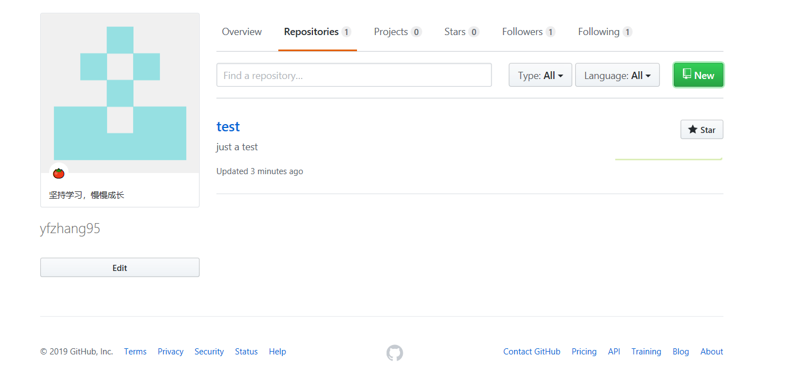
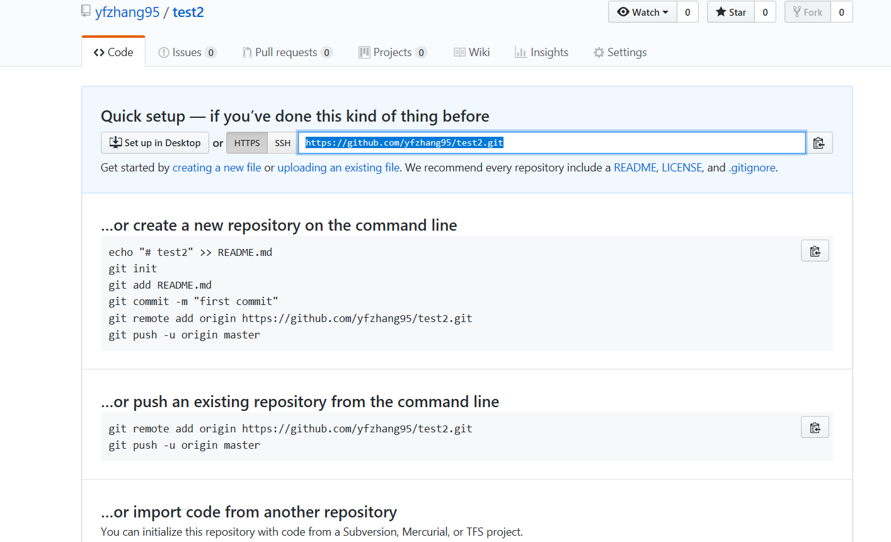

# GitHub中上传
1. 在GitHub中创建Repositories  

    

      

2. 将创建的git仓库克隆到桌面  

    + 克隆代码： *git clone https://github.com/yfzhang95/test2.git*  

      

3. 在克隆的文件夹下创建文件，并编写文件内容
    + 运用markdown语法进行编写
    + [markdown语法](https://www.jianshu.com/p/191d1e21f7ed)
4. 运用 *git add "文件名"* 将文件上传到仓库中
5. 运用 *git commit -m "文件描述"* 启动文本编辑器以便输入本次提交的说明
6. 运用 *git push* 推送提交的内容并更新git仓库内容  
7. [git相关命令](https://www.jianshu.com/p/15a4dee9c5df)