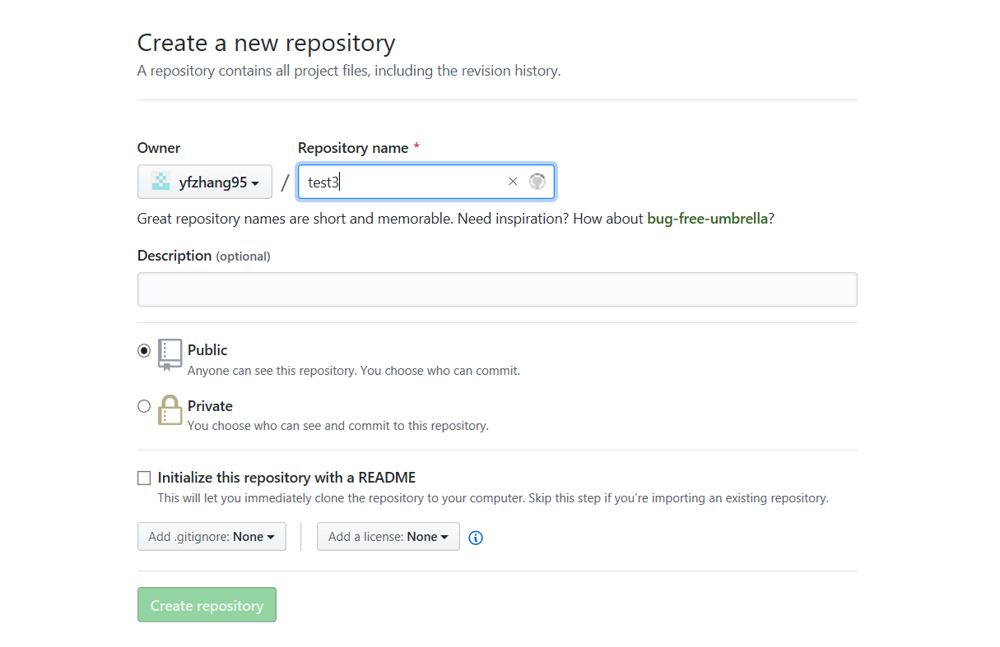

# GitHub中上传
1. 在GitHub中创建Repositories

2. 将创建的git仓库克隆到桌面  
    克隆代码：* git clone https://github.com/yfzhang95/test2.git *

3. 在克隆的文件夹下创建文件，并编写文件内容
4. 运用* git add "文件名" *将文件上传到仓库中
5. 运用* git commit -m "文件描述" *启动文本编辑器以便输入本次提交的说明
6. * git push * 推送提交的内容并更新git仓库内容
[git相关命令](https://www.jianshu.com/p/15a4dee9c5df)